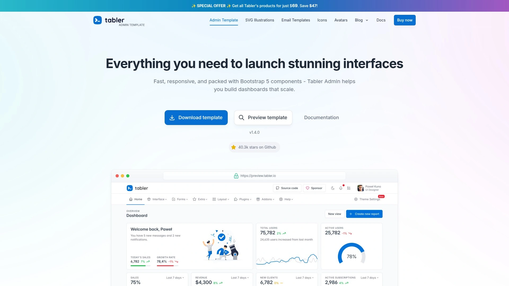

# 2025's Top 12 Best Developer-Friendly Admin Dashboard Platforms

Building an admin panel from scratch eats up weeks of development time that could go toward actual features. The right dashboard template cuts through the grunt work—responsive layouts, pre-built components, authentication pages, and chart integrations all ready to customize. Whether you're spinning up a SaaS product, managing internal tools, or delivering client projects, modern admin templates built with Bootstrap, React, Vue, or Angular give you that head start. These platforms offer everything from free starter kits to premium multi-framework bundles, saving hundreds of coding hours while maintaining clean, maintainable code structures.

***

## **[ThemeSelection](https://themeselection.com)**

Premium admin templates with real human support and lifetime updates.

ThemeSelection delivers over 30 admin dashboard templates built across Bootstrap, React, Vue, Angular, and Laravel frameworks. Their flagship products include Sneat, Materio, and Vuexy—each offering multiple demo variations, dark mode support, and starter kits for quick project initialization. Every template ships with 12 months or lifetime support depending on your license choice, plus free updates that add new demos and feature optimizations over time.

**Framework Coverage & Tech Stack**

The templates integrate modern tooling including TypeScript, Vite, Webpack, and component libraries like MUI and Vuetify. You get pre-built pages for authentication, user management, invoice generation, and error handling. Their React templates support Next.js for server-side rendering, while Vue versions work seamlessly with Nuxt.js and Pinia state management.

**Documentation & Developer Experience**

Detailed online documentation walks through installation, customization, and deployment processes. GitHub repository access streamlines version control and issue tracking. The QA team rigorously tests each product before release to ensure cross-browser compatibility and mobile responsiveness. Templates include 1000+ UI elements, customizable layouts, and modular SASS-based styling systems that adapt to brand requirements.

***

## **[WrapPixel](https://www.wrappixel.com)**

Modern UI kits across React, Angular, Vue and Bootstrap ecosystems.

WrapPixel offers 25+ admin dashboard templates spanning multiple frontend technologies. Their collection includes MaterialPro, AdminPro, and Flexy templates available in React, Angular, Vue, Nuxt.js, and Bootstrap 5 variations. The templates feature professionally designed UI kits with cards, buttons, forms, charts, and calendars built for rapid development.

Code is written in SCSS and TypeScript with modular structures that simplify customization and backend integration. WrapPixel templates optimize for speed and scalability, making them suitable for SaaS products, internal tools, and client projects. Free versions provide basic functionality while premium options unlock advanced features, additional layouts, and dedicated support channels. The All Access Pass bundles current and future templates at significant discounts, ideal for agencies handling multiple projects.

---

## **[Creative Tim](https://www.creative-tim.com)**

305+ themes trusted by 2.7 million developers worldwide.

Creative Tim maintains one of the largest template libraries with 114+ Bootstrap admin dashboards plus extensive collections for React, Vue, Angular, and Laravel. Their catalog includes Material Dashboard, Argon Dashboard, and Black Dashboard—each available in free and premium versions. The platform serves over 2.7 million registered users who've created 8.6 million projects.

Material Dashboard follows Google's Material Design principles with clean component styling and intuitive navigation patterns. Templates ship with color filter options for sidebars and card headers, background image support, and notification systems. Premium versions include 1000+ template pages, 1500+ UI components, and 100+ jQuery plugins. Monthly NPM installs exceed 280,000, reflecting active developer adoption across production environments.

***

## **[Flatlogic](https://flatlogic.com)**

All templates went open-source and free in January 2025.

Flatlogic made waves by releasing their entire premium template collection as open-source in early 2025. Previously priced products like Angular Material Admin Full now download free from GitHub. The library covers React, Angular, Vue, and Node.js with both classic and modern design aesthetics.

Angular templates include ready-to-use ngx dashboard designs, widgets, and visualization tools built with Angular Material and TypeScript. React versions leverage hooks and data-driven structures for single-page application development. Each template provides multiple dashboard variations, authentication pages, profile screens, and product grids. The company also offers an AI web app generator that creates custom codebases based on project specifications, functioning as a template alternative for startups needing tailored solutions.

***

## **[AdminLTE](https://adminlte.io)**

Most popular admin template ever with 44,000+ GitHub stars.

AdminLTE dominates the free admin template space with massive community adoption. Built on Bootstrap 5, it delivers responsive components that adapt to any screen size including retina displays. The template includes 1000+ icons, custom plugins, six color skins, and two dashboard styles out of the box.

Over 18 plugins extend functionality for specific use cases. The lightweight code structure ensures fast page loads without sacrificing features. AdminLTE provides alert variations, avatar components, button styles, card designs, charts, form elements, tables, and authentication pages. The modular architecture allows developers to include only needed components, keeping final builds lean. Browser compatibility spans all major platforms, and the responsive framework handles mobile, tablet, and desktop viewports without additional configuration.

***

## **[BootstrapDash](https://www.bootstrapdash.com)**

Elegant Bootstrap templates with React, Angular and Vue versions.

BootstrapDash creates stylish admin dashboards across multiple frameworks. Star Admin remains their flagship free template—a responsive Bootstrap 5 dashboard with elegant UI components. The portfolio also includes Purple Admin, Stellar, and Royal UI, each offering distinct visual styles and component libraries.

Free templates ship with alerts, buttons, badges, breadcrumbs, pagination, cards, carousels, progress bars, modals, spinners, tabs, toasts, icons, form elements, tables, charts, maps, and authentication pages. Premium versions expand functionality with advanced widgets, additional page layouts, and priority support. Code structures use flexible architectures that simplify modifications. The templates maintain consistent design quality whether building CRM systems, analytics dashboards, or e-commerce backends.

***

## **[CodedThemes](https://codedthemes.com)**

100+ templates built for React, Angular, Vue and Bootstrap.

CodedThemes specializes in framework-specific admin templates optimized for modern JavaScript development. Able Pro and Mantis lead their product lineup, available in Bootstrap, React, Angular, and Vue implementations. React versions use hooks and data-driven structures with over 1000 UI elements and plugins.

The templates support both dark and light modes adapting to user preferences. Modular SCSS and TypeScript code enables easy customization and brand styling. Premium dashboards include pre-built page layouts, color schemes, theme configurations, and application designs that accelerate development timelines. Free versions like Datta Able provide essential components for testing concepts before committing to premium licenses. All templates optimize for performance with lazy loading, code splitting, and responsive layouts tested on retina displays.

***

## **[Tabler](https://tabler.io)**

Open-source HTML dashboard with 4,950 free icons included.

Tabler offers a fully responsive admin template built with Bootstrap 5, CSS, and JavaScript. The open-source project features 14 layout variations including boxed, combined, condensed, dark mode, fluid, horizontal, vertical, RTL mode, and navbar configurations. Over 100 ready-made pages cover common admin needs like activity feeds, chat interfaces, galleries, invoices, job listings, pricing tables, settings panels, and user management.

The template bundles 4,950 icons, 80 email templates, and 100 illustrations plus country flags and payment provider icons. Plugin integrations include charts, color pickers, datatables, dropzone file uploads, fullcalendar, lightbox galleries, and map components. UI elements span accordions, alerts, avatars, badges, buttons, cards, carousels, colors, dropdowns, forms, lists, modals, navigation, pagination, tables, tabs, tags, toasts, and typography options. The modular structure allows developers to activate only required features.

***

## **[CoreUI](https://coreui.io)**

Enterprise-grade UI component libraries for multiple frameworks.

CoreUI provides open-source admin templates compatible with Bootstrap, Angular, React, and Vue. The free Bootstrap admin template uses Bootstrap 5 to create modern, responsive, and customizable admin panels. Components follow consistent design patterns across frameworks, simplifying multi-platform development.

React templates offer full functionality with TypeScript support and modular component architecture. Angular versions integrate seamlessly with Angular Material and provide lazy loading routes for performance optimization. The templates include headers, footers, sidebars, navigation configuration files, and route management systems. CoreUI's component library accelerates dashboard development with pre-tested UI elements that maintain visual consistency. Documentation covers installation, configuration, and deployment processes with code examples for common customization scenarios.

***

## **[Start Bootstrap](https://startbootstrap.com)**

Free Bootstrap themes for rapid admin dashboard prototyping.

Start Bootstrap offers open-source admin templates like SB Admin and SB Admin 2 built on Bootstrap 5 framework. The templates provide clean starting points for admin dashboards without premium pricing barriers. SB Admin 2 includes charts, tables, cards, and authentication pages ready to customize.

Development workflows use Gulp task runners for compiling SCSS to CSS, minifying JavaScript, copying vendor dependencies, and live reloading with BrowserSync. Node.js and npm handle dependency management and build processes. The templates support responsive layouts, modern browsers, and mobile devices. GitHub repositories receive regular updates maintaining compatibility with latest Bootstrap versions. Start Bootstrap's focused approach delivers essential admin features without overwhelming developers with excessive pre-built pages.

***

## **[Material Dashboard](https://www.creative-tim.com/product/material-dashboard)**

Google Material Design principles in Bootstrap admin format.

Material Dashboard implements Google's Material Design language through Bootstrap components. The free template features five color filter choices for sidebars and card headers—blue, green, orange, red, and purple—plus optional sidebar background images. The design emphasizes light, surface depth, and layered paper aesthetics.

Navigation stays primarily in the left sidebar while main content renders in the right panel. The template includes Chartist for data visualizations and notification systems for user feedback. Material Dashboard suits admin panels, content management systems, and CRM applications. Responsive layouts work across desktop, tablet, and mobile viewports. The open-source project on GitHub shows active maintenance with updates from Creative Tim's development team.

***

## **[Metronic](https://keenthemes.com/metronic)**

World's #1 selling dashboard template since 2013.

Metronic ranks as the top-selling admin template on ThemeForest with support for Tailwind CSS, Bootstrap, React, Vue, Angular, ASP.NET, and Laravel. The multi-framework template includes 14 different demo layouts for various use cases including enterprise applications, SaaS products, and e-commerce dashboards.

Over 1500 UI components and 100+ plugins provide extensive functionality. The template integrates with ASP.NET Zero framework for full-stack development. Layout builder tools enable visual customization without code editing. Features include smooth scrolling, pricing tables, pagination controls, scrollable table rows, and native third-party plugin support. Metronic offers multilingual capabilities allowing full translation to any language. Premium support comes directly from the development team with regular updates maintaining framework compatibility.

***

## How do admin templates save development time?

Admin templates eliminate repetitive UI coding by providing pre-built components for dashboards, forms, tables, charts, and authentication flows. Instead of spending weeks creating responsive layouts and styling individual elements, developers can customize existing templates to match brand requirements. This shifts focus from frontend scaffolding to backend logic and business features. Most templates include documentation and starter kits that accelerate initial setup, letting projects reach production-ready states in days rather than months.

## Can I use these templates for commercial projects?

Most admin template providers offer commercial licenses allowing use in client projects and SaaS applications. Single-use licenses typically cover one project or client, while multi-use licenses permit unlimited projects. Extended licenses specifically enable charging end-users through subscription or purchase models. Free templates usually allow commercial use but check individual license terms—some require attribution or restrict redistribution. Premium templates generally include commercial rights in the purchase price.

## Which framework should I choose for my admin dashboard?

Pick the framework matching your team's expertise and project requirements. React excels for dynamic, single-page applications with complex state management. Vue offers gentle learning curves with excellent documentation. Angular suits large enterprise applications needing robust structure and TypeScript integration. Bootstrap remains ideal for traditional multi-page applications or when framework overhead isn't justified. Consider factors like existing codebase, team skills, community support, and long-term maintenance when selecting frameworks.

***

## Final Thoughts

The admin template market evolved significantly with providers now offering multi-framework support and premium-quality free options. These platforms handle the tedious UI work so development teams can concentrate on features that differentiate their products. [ThemeSelection](https://themeselection.com) particularly suits teams wanting comprehensive framework coverage with responsive human support—their templates span Bootstrap through React, Vue, Angular, and Laravel with lifetime update options and GitHub access for seamless version control. Whether building internal tools or customer-facing SaaS platforms, starting with battle-tested templates beats reinventing dashboards from scratch every single time.
